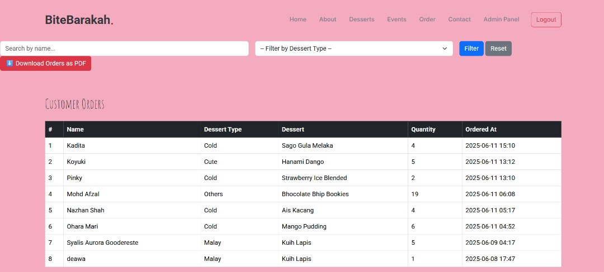

# BiteBarakah - Halal Online Dessert Ordering System
## Laravel MVC Web Application Proposal And Final Report

## Group Members

| Name                          | Matric No. |
|-------------------------------|------------|
| Muhammad Asyraf Abdul Jameel  | 2217737    |
| Nur Adzhan Hanis b. Mohd Shahzihan | 2210403 |
| Nabil Azwar b. Noor Azlan     | 2318721    |
| Zahin Zuhairi b. Mohd Rahman  | 2222789    |
| Siti Nursajeedah bt. Shabuddin | 2313226   |

## 1. INTRODUCTION 
Today, web applications bring businesses and customers together quickly, and Laravel simplifies how they are built by using MVC, Eloquent ORM, and Blade templating. Because of these features, websites can be made secure and organized in less time.

We are creating BiteBarakah, a halal-certified dessert shop on the web using Laravel. Clients will be able to view and purchase Shariah-compliant desserts, while the admin panel makes it easy to oversee all orders and the virtual shop. Because Laravel includes CRUD operations, authentication, and routing features, the user’s experience on your e-commerce site is both halal and smooth.

We have chosen Laravel since it provides a neat MVC design, methods for easy database management, and support for dynamic front-end creation using Blade. Participating in this project will teach you how to build a web store with a user-friendly interface that follows Islamic principles. People will be able to access a safe, user-friendly, and attractive website that meets halal standards. 

## 2. OBJECTIVES
BiteBarakah’s main aim is to provide convenient and Shariah-approved baking and dessert ordering for customers as well as system users. The purpose is to achieve ease in using the site, effective management of orders, and significant communication, adhering to Islamic teachings. BiteBarakah works to ensure that its site is attractive and useful for users, helping meet their expectations and encouraging respect among different cultures.
## The main objectives are : 
- BiteBarakah makes it simple for customers to choose from various desserts, learn about each product, sign up, log in and handle their orders using an easy cart and checkout system.
- To help administrators efficiently manage desserts and orders through BiteBarakah by adding, altering, updating when needed and checking order statuses.
- All the desserts on BiteBarakah must be halal-certified and the website should not feature anything that goes against Shariah ethics.

Ultimately, BiteBarakah seeks to create an enjoyable and trustworthy online space for dessert enthusiasts, where convenience meets compliance with Islamic principles in every feature and function.

## 3. FEATURES AND FUNCTIONALITIES
The proposed dessert-themed web application is designed to facilitate an engaging, user-friendly, and Shariah-compliant online dessert ordering experience. This system aims to streamline dessert browsing, ordering, and management for both customers and administrators. The core features and functionalities include the following:
## ❖ Homepage and User Dashboard
- The homepage features a visually appealing introduction to the platform, highlighting popular dessert items, categories, and promotional content.
- Users are provided with intuitive navigation to access various sections such as Dessert Listings, About Us, and Contact.
##  ❖ Dessert Listings and Categories
- Desserts are organized into specific categories (e.g., Cakes, Cookies, Traditional Malay Desserts, Japanese-Inspired Sweets) to enhance browsing efficiency.
- Each dessert listing displays essential information including image, name, description, availability status, and price.
##  ❖ User Registration and Authentication
- New users are required to register to access personalized features such as order tracking and history.
- Secure login and logout functionality ensures authenticated access to user-specific content and order management.
##  ❖ Order Management (Add to Cart & Checkout)
- Registered users can add multiple dessert items to a cart and proceed to checkout.
- A simplified order form allows users to confirm their order and submit relevant information for fulfillment (e.g., name, contact number).
- Orders are stored and tracked in the system for future reference by both users and administrators.
##  ❖ Admin Management Panel
- Administrators are granted access to a backend dashboard to manage all desserts in the system.
- Core functionalities include adding new dessert items, editing existing information, updating availability, and removing products when necessary.
- Administrators can also view customer orders and update their status (e.g., pending, completed).
##  ❖ Order History Tracking
- Users can view a complete list of their previously placed orders including order dates, items purchased, total price, and order status.
- This feature supports transparency and user convenience, encouraging repeat visits.
##  ❖ Contact and Feedback Form
- A structured form is provided for users to submit inquiries, feedback, or issues regarding their experience or orders.
- Submissions are directed to the admin panel or email for appropriate follow-up.
##  ❖ Shariah-Compliant Content
- All desserts featured in the application are guaranteed to be halal and prepared in accordance with Islamic dietary laws.
- The platform strictly avoids any content or features that contradict Islamic values and ethics.

## 4. ERD RELATIONSHIP

## 5. SEQUENCE DIAGRAM 

## 6. REFERENCE

Markdownguide.org. (n.d.). Basic syntax. Markdown Guide. https://www.markdownguide.org/basic-syntax/

Swimm. (n.d.). Mermaid.js: A complete guide. Swimm. https://swimm.io/learn/mermaid-js/mermaid-js-a-complete-guide

## 7. SCREENSHOT OF WEBSITE

## ❖ Homepage

## ❖ Product page (Malay Desserts)

## ❖ Product page (Cute Desserts)

## ❖ Order page

## ❖ Admin page

## 8. CHALLENGES

❖ Merge Conflicts: Multiple team members working on the same files can lead to overlapping changes that require manual resolution, causing delays and potential errors.

❖ Lack of Version Control Discipline: Inconsistent commitment practices, unclear commit messages, or a lack of understanding of Git basics can result in a messy repository history, making it difficult to track changes or revert to previous versions.

❖ Ineffective Code Reviews: If code reviews are not thorough, timely, or constructive, it can lead to lower code quality, missed bugs, and slow development cycles.

❖ Branch Management Complexity: Without a clear and agreed-upon branching strategy, managing numerous feature, hotfix, or release branches can become confusing and lead to incorrect merges.

❖ Lack of Communication: Poor communication regarding ongoing tasks, planned features, or resolved issues can lead to duplicated efforts, unexpected conflicts, and team members working with outdated information.

## 9. OUR LAVAREL CODE
Visit our code [Bitebarakah](https://github.com/5aizo/bitebarakah2)

